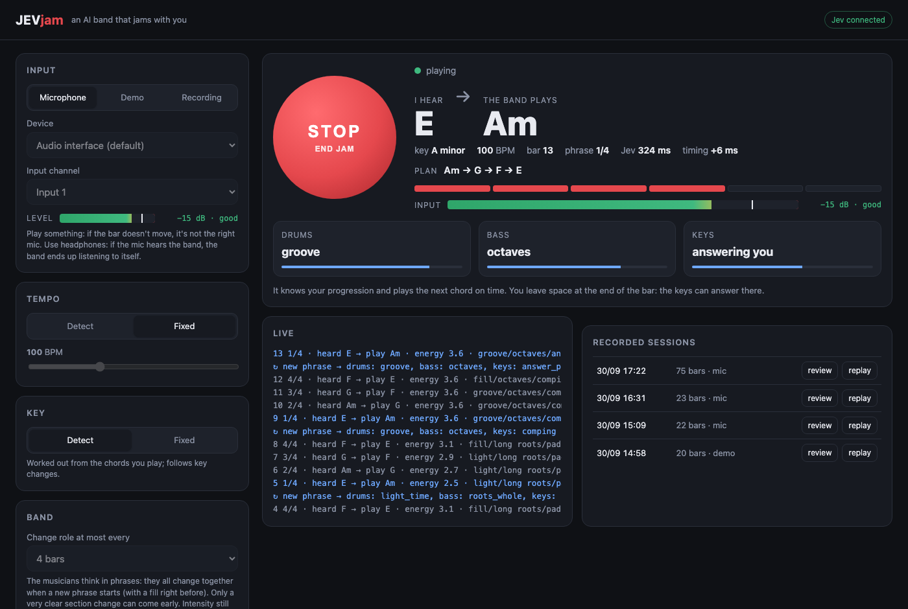
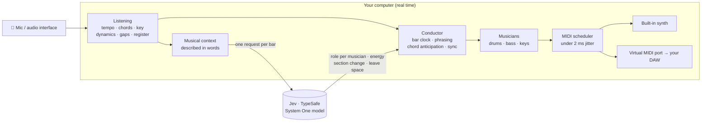
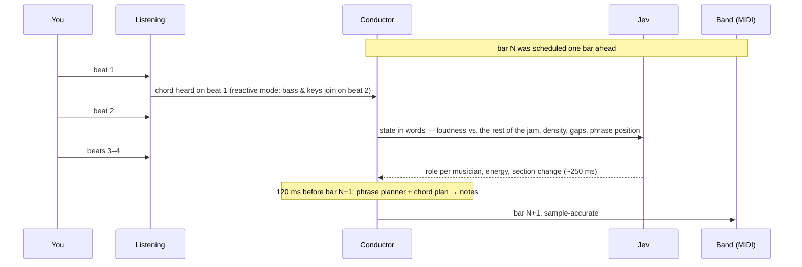

# JEVjam

An AI band that **listens to what you play and jams along with you live over MIDI**. It
uses [Jev](https://docs.typesafe.ai) (TypeSafe's System One model) as the musical "ear" that
decides what each musician plays in the next bar. The goal is for playing with an AI to
feel like improvising with other musicians, not like running a song generator.



*The local app mid-jam: what it hears vs. what the band plays, the chord plan it anticipates,
phrase position, timing offset, input level meter and each musician's current role. (This
screenshot uses the built-in preview data: open `jevjam/web/index.html?preview`.)*

## How it works

Jev does not generate notes. It **judges**: more energy? a fill? leave space? which pattern
should the drummer play? Deterministic code turns those judgments into notes, so everything
time-critical stays local, and Jev's network latency never touches the audio because it
always decides the **next** bar.



What happens inside every bar:



The main ideas, each measured on recorded jams (see [docs/ARCHITECTURE.md](docs/ARCHITECTURE.md)):

| Idea | What it does |
|---|---|
| **Jev judges, code plays** | One fan-out request per bar with 7 typed questions (Choice / Score / Noul). Numbers are turned into words first, because Jev reasons better with descriptions than with raw values. |
| **Phrases, not bars** | Musicians keep their role for a whole phrase (2/4/8/16 bars) and all change together, with a drum fill right before. Only a very clear section change can cut a phrase short. Intensity still follows you bar by bar, smoothly. |
| **Chord anticipation** | It recognises common progressions (pop I‑V‑vi‑IV, doo‑wop, Andalusian, ii‑V‑I…) from any starting point, so the band plays the next chord on time, before the progression has even repeated. |
| **Reactive mode** | When the next chord can't be anticipated, bass and keys listen to your beat 1 and come in on beat 2, like a musician who doesn't know the changes. |
| **Ensemble timing** | Phase and period correction, as musicians do with each other. A constant offset (e.g. a wireless mic) is learned as latency and not "corrected", so the band doesn't drift. |
| **Call and response** | It learns where you usually leave space and in which register you play; the keys answer in your gaps and in another register. |
| **Real-time key detection** | The key comes from the recognised chords, not just from pitch profiles, which confuse neighbouring keys (C vs. G major). |

## Setup

```sh
python3 -m venv .venv && .venv/bin/pip install -e '.[dev]'
echo 'TYPESAFE_API_KEY=...' > .env      # key from console.typesafe.ai (.env is git-ignored)
```

## App

```sh
.venv/bin/python -m jevjam.app          # opens http://127.0.0.1:8765
```

The app includes:

- **Every option**: input device and channel, with a level meter so you can check the mic
  before starting; tempo; key; phrase length; output; number of bars; recording.
- **A big red button** to start and stop the jam.
- **The live jam** as described above.
- **Recorded sessions**, which you can review or replay.

It only listens on 127.0.0.1: your mic, MIDI and API key stay on your machine.

## Command line

```sh
.venv/bin/python -m jevjam --input demo                      # a synthetic player strums Am-F-C-G
.venv/bin/python -m jevjam --input mic --bpm 100             # you play (fixed tempo = most robust)
.venv/bin/python -m jevjam --input mic --bpm 100 --key Am    # plus a fixed key
.venv/bin/python -m jevjam --out virtual                     # MIDI to a virtual "JEVjam" port for your DAW
.venv/bin/python -m jevjam --phrase 8                        # musicians change role at most every 8 bars
.venv/bin/python -m jevjam --list-devices                    # audio inputs and MIDI ports
```

- **Outputs**:
  - `synth`: the built-in synth (default): FM electric piano, bass, drums, stereo and reverb.
  - `virtual`: a MIDI port called "JEVjam". Drums are on channel 10, bass on 1 and keys on 2.
  - `both`: the two above.
  - The name of an existing MIDI port.
- **Use headphones** with a mic. If the mic hears the band, the band ends up listening to itself.
- **Tempo detection:** automatic detection can confuse some strumming patterns with a
  different tempo. A fixed tempo (`--bpm`, or "Fixed" in the app) is the reliable option for now.

## Record, review, tune

Every run is recorded to `recordings/session-YYYYMMDD-HHMMSS/`. Use `--no-record` to turn it off.

| File | Contents |
|---|---|
| `input.wav` | what came in through the mic / interface |
| `band.mid` | what the band played (open it in your DAW next to `input.wav`) |
| `mix.wav` | you + the band, to listen back to the jam |
| `bars.jsonl` | for every bar: chord heard and its candidates, level and onsets per beat, gaps, timing, the state sent to Jev, its answer and what the band played |

```sh
.venv/bin/python -m jevjam.review                                    # review the latest session
.venv/bin/python -m jevjam.review recordings/session-X --reanalyze  # re-analyse the audio with the current code
.venv/bin/python -m jevjam --input recordings/session-X/input.wav   # replay the jam (same input, new code)
```

The review summarises:

- chords recognised;
- how often the band played your chord;
- the key;
- how closely the band's energy follows your volume;
- timing offset and latency;
- whether answers landed in your gaps;
- input quality: level, band bleeding into the mic, and whether there are pitched notes at all.

## Tests

```sh
.venv/bin/python -m pytest      # analysis, musicians, phrasing, sync, dialogue, app (no network)
```

## Project layout

| File | Role |
|---|---|
| `jevjam/analysis.py` | streaming listening: onsets, tempo, chroma, chords, key, dynamics, register, level meter |
| `jevjam/context.py` | measurements → musical context in words for Jev |
| `jevjam/brain.py` | the questions asked to Jev (7 per bar, fan-out) and an async client with a deadline |
| `jevjam/conductor.py` | bar clock, downbeat, harmony modes (predicted / anticipated / reactive), deadlines |
| `jevjam/phrasing.py` | roles change by phrase (voting + hysteresis), fills as ornaments, gradual energy |
| `jevjam/theory.py` | chords, keys, voicings, functional harmony and the progression library |
| `jevjam/keyfinder.py` | real-time key from recognised chords |
| `jevjam/sync.py` | ensemble timing: phase/period correction with latency estimation |
| `jevjam/dialogue.py` | call and response: the player's gaps and register |
| `jevjam/band.py` | drums, bass and keys: role → deterministic MIDI notes |
| `jevjam/midi_out.py` | precise MIDI scheduler and outputs (virtual port, existing port) |
| `jevjam/synth.py` | built-in instrument: FM electric piano, bass, drums, stereo, reverb |
| `jevjam/session.py` | one jam end to end (shared by the CLI and the app) |
| `jevjam/app.py`, `jevjam/web/` | local app: server (stdlib + Server-Sent Events) and page |
| `jevjam/sources.py` | mic, WAV file and synthetic player |
| `jevjam/recording.py` | session recording (WAV, MIDI, bars, mix) |
| `jevjam/review.py` | review of recorded sessions |

## Documentation

- [docs/ARCHITECTURE.md](docs/ARCHITECTURE.md): what Jev can and can't do, the architecture,
  and every design decision with the measurements behind it.
- [docs/MUSICAL-METHODS.md](docs/MUSICAL-METHODS.md): the musical methods researched, with
  sources, and what has been implemented.
